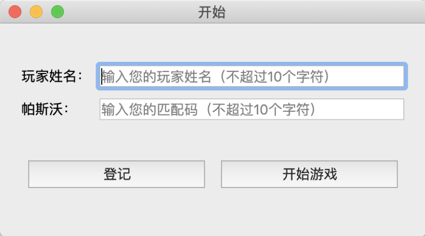
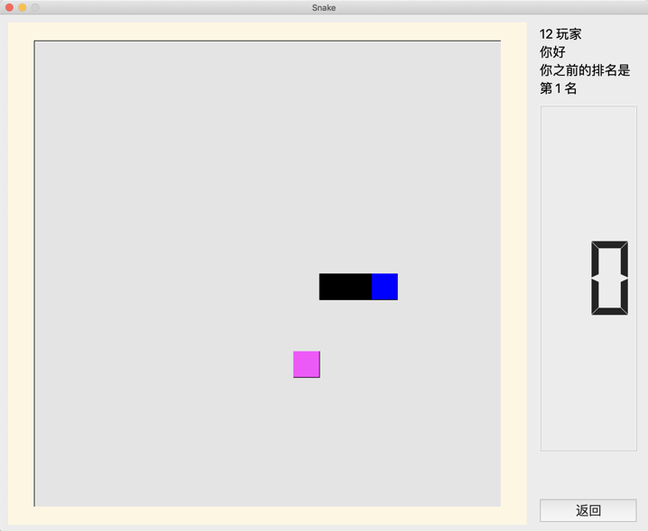
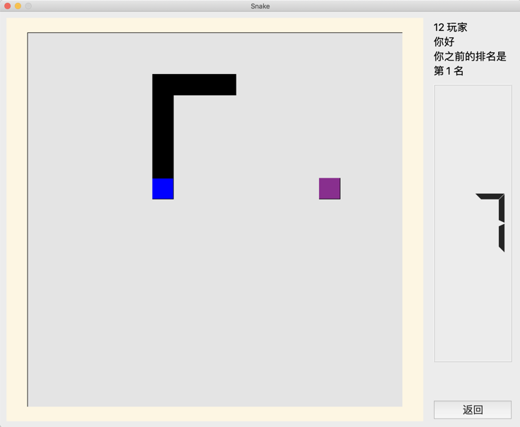
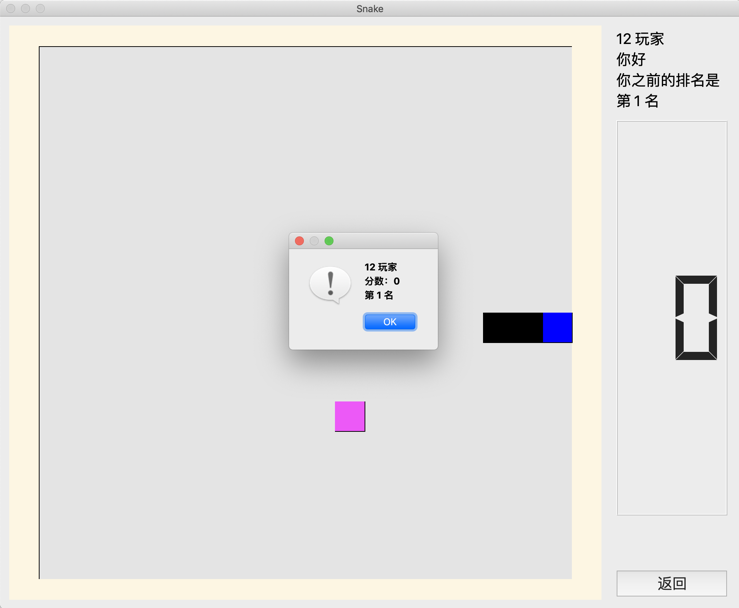

# 简陋的贪吃蛇小游戏

### 1.简介

一个暑假C++实训的作业，一个用**Qt**做的一个贪吃蛇单机版小游戏，加上用户登录和二进制文件储存信息的功能。

###  2.开发环境

* macOS 10.14.5
* Qt 5.13.0

### 3.编译

1. 用**Qt**打开`Snake.pro`文件。
2. 使用编译运行（在[当前开发环境](#environment)测试过有效，其他环境结果尚未知）。
3. 首次运行，会出现以下提示，属于正常，确认对话框，用作创建玩家的文件将会创建，重新运行`Snake`程序即可。

### 4.使用说明

* 运行软件，是开始界面，可以自创一个玩家姓名与密码进行登记，再登录开始游戏。

**如果姓名除输入`Admin`，帕斯沃（password）中输入`nimdA`就会将文件中之前的玩家信息清除。**

* 游戏中的蛇采用`WSAD`方向键进行移动，撞墙或者吃自己都会结束游戏。

* 当前游戏得分可在LED显示中看到，游戏结束后会出现累积的分和在已登记玩家中的自己排名。

* 最后玩家可选择返回重新登录再开始新一轮的游戏，也可选择关闭本程序。